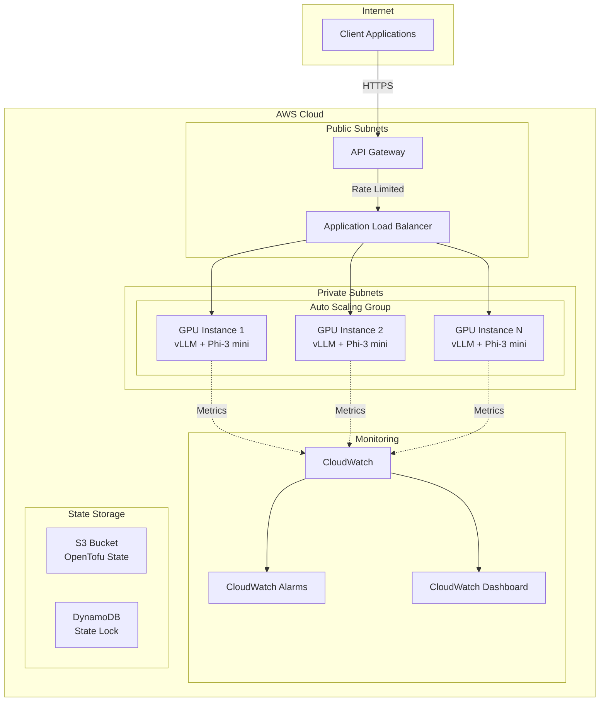

# Design Document: LLM Inference Service

## Overview

This design describes the architecture for deploying a Phi-3 mini LLM inference service on AWS using OpenTofu. The service uses vLLM for high-throughput inference, runs on GPU instances with auto-scaling, and exposes a rate-limited REST API through API Gateway.

The infrastructure follows AWS best practices with a secure VPC configuration, Application Load Balancer for traffic distribution, and comprehensive CloudWatch monitoring for operational visibility.

## Architecture



### High-Level Flow

1. Client sends HTTPS request to API Gateway endpoint
2. API Gateway enforces IP-based rate limiting (100 req/min per IP)
3. Valid requests forwarded to Application Load Balancer
4. ALB distributes requests across healthy GPU instances in Auto Scaling Group
5. vLLM processes inference request and returns response
6. CloudWatch collects metrics from all components
7. Auto Scaler adjusts instance count based on GPU utilization

## Components and Interfaces

### 1. OpenTofu Module Structure

```
infrastructure/
├── main.tf                 # Root module, orchestrates all components
├── variables.tf            # Input variables
├── outputs.tf              # Output values
├── versions.tf             # Provider and OpenTofu version constraints
├── backend.tf              # S3 backend configuration
├── modules/
│   ├── networking/         # VPC, subnets, security groups
│   │   ├── main.tf
│   │   ├── variables.tf
│   │   └── outputs.tf
│   ├── compute/            # EC2, ASG, Launch Template
│   │   ├── main.tf
│   │   ├── variables.tf
│   │   ├── outputs.tf
│   │   └── user_data.sh
│   ├── load_balancer/      # ALB, Target Group, Listeners
│   │   ├── main.tf
│   │   ├── variables.tf
│   │   └── outputs.tf
│   ├── api_gateway/        # API Gateway, Rate Limiting
│   │   ├── main.tf
│   │   ├── variables.tf
│   │   └── outputs.tf
│   ├── monitoring/         # CloudWatch metrics, alarms, dashboard
│   │   ├── main.tf
│   │   ├── variables.tf
│   │   └── outputs.tf
│   └── demo/               # S3 + CloudFront demo interface
│       ├── main.tf
│       ├── variables.tf
│       ├── outputs.tf
│       └── files/
│           ├── index.html
│           ├── style.css
│           └── app.js
└── environments/
    ├── dev.tfvars
    └── prod.tfvars
```

### 2. Networking Module

**Purpose**: Creates VPC infrastructure with public/private subnet separation.

**Resources**:
- VPC with DNS support enabled
- 2 public subnets (for ALB) across AZs
- 2 private subnets (for GPU instances) across AZs
- Internet Gateway for public subnets
- NAT Gateway for private subnet egress
- Route tables for each subnet type
- Security groups for ALB and EC2 instances

**Interface**:
```hcl
# Inputs
variable "vpc_cidr" {
  description = "CIDR block for VPC"
  type        = string
  default     = "10.0.0.0/16"
}

variable "environment" {
  description = "Environment name"
  type        = string
}

variable "availability_zones" {
  description = "List of AZs to use"
  type        = list(string)
}

# Outputs
output "vpc_id" {}
output "public_subnet_ids" {}
output "private_subnet_ids" {}
output "alb_security_group_id" {}
output "ec2_security_group_id" {}
```

### 3. Compute Module

**Purpose**: Manages GPU instances running vLLM with Phi-3 mini.

**Resources**:
- Launch Template with GPU AMI and user data
- Auto Scaling Group with GPU utilization scaling policies
- IAM Role and Instance Profile for EC2
- CloudWatch Agent configuration

**Instance Configuration**:
- Instance type: g5.xlarge (1 NVIDIA A10G GPU, 4 vCPUs, 16GB RAM)
- AMI: AWS Deep Learning AMI (Ubuntu) with NVIDIA drivers
- Storage: 100GB gp3 root volume for model weights

**User Data Script** (simplified):
```bash
#!/bin/bash
# Install vLLM
pip install vllm

# Download Phi-3 mini model
huggingface-cli download microsoft/Phi-3-mini-4k-instruct

# Start vLLM server
python -m vllm.entrypoints.openai.api_server \
  --model microsoft/Phi-3-mini-4k-instruct \
  --host 0.0.0.0 \
  --port 8000 \
  --gpu-memory-utilization 0.9
```

**Interface**:
```hcl
# Inputs
variable "instance_type" {
  description = "EC2 instance type"
  type        = string
  default     = "g5.xlarge"
}

variable "min_instances" {
  description = "Minimum number of instances"
  type        = number
  default     = 1
}

variable "max_instances" {
  description = "Maximum number of instances"
  type        = number
  default     = 4
}

variable "scale_up_threshold" {
  description = "GPU utilization % to trigger scale up"
  type        = number
  default     = 70
}

variable "scale_down_threshold" {
  description = "GPU utilization % to trigger scale down"
  type        = number
  default     = 30
}

# Outputs
output "asg_name" {}
output "asg_arn" {}
```

### 4. Load Balancer Module

**Purpose**: Distributes traffic across healthy inference instances.

**Resources**:
- Application Load Balancer (internet-facing)
- Target Group with health check configuration
- HTTP Listener (redirects to HTTPS)
- HTTPS Listener with ACM certificate

**Health Check Configuration**:
```hcl
health_check {
  enabled             = true
  healthy_threshold   = 2
  unhealthy_threshold = 3
  timeout             = 5
  interval            = 30
  path                = "/health"
  port                = "8000"
  protocol            = "HTTP"
  matcher             = "200"
}
```

**Interface**:
```hcl
# Inputs
variable "vpc_id" {}
variable "public_subnet_ids" {}
variable "security_group_id" {}
variable "certificate_arn" {}

# Outputs
output "alb_dns_name" {}
output "alb_arn" {}
output "target_group_arn" {}
```

### 5. API Gateway Module

**Purpose**: Provides REST API with IP-based rate limiting.

**Resources**:
- HTTP API (API Gateway v2)
- VPC Link for private ALB integration
- Routes for /v1/completions and /health
- Usage plan with IP-based throttling

**Rate Limiting Configuration**:
```hcl
# IP-based rate limiting via WAF
resource "aws_wafv2_web_acl" "api_rate_limit" {
  name  = "${var.environment}-api-rate-limit"
  scope = "REGIONAL"

  rule {
    name     = "ip-rate-limit"
    priority = 1

    action {
      block {}
    }

    statement {
      rate_based_statement {
        limit              = 100
        aggregate_key_type = "IP"
      }
    }

    visibility_config {
      sampled_requests_enabled   = true
      cloudwatch_metrics_enabled = true
      metric_name                = "IPRateLimit"
    }
  }
}
```

**Interface**:
```hcl
# Inputs
variable "alb_dns_name" {}
variable "alb_listener_arn" {}
variable "vpc_id" {}
variable "private_subnet_ids" {}
variable "rate_limit_per_ip" {
  description = "Requests per minute per IP"
  type        = number
  default     = 100
}

# Outputs
output "api_endpoint" {}
output "api_id" {}
```

### 6. Monitoring Module

**Purpose**: Provides observability through CloudWatch metrics, alarms, and dashboards.

**Resources**:
- CloudWatch Log Groups for vLLM logs
- Custom metrics for latency, throughput, GPU utilization
- CloudWatch Alarms for SLA violations
- CloudWatch Dashboard for operational visibility

**Metrics Collected**:
| Metric | Description | Unit |
|--------|-------------|------|
| RequestLatencyP50 | 50th percentile latency | Milliseconds |
| RequestLatencyP95 | 95th percentile latency | Milliseconds |
| RequestLatencyP99 | 99th percentile latency | Milliseconds |
| RequestsPerSecond | Throughput | Count/Second |
| GPUUtilization | GPU usage percentage | Percent |
| ActiveInstances | Running instance count | Count |
| EstimatedCost | Hourly cost estimate | USD |

**Alarm Configuration**:
```hcl
resource "aws_cloudwatch_metric_alarm" "high_latency" {
  alarm_name          = "${var.environment}-high-latency-p99"
  comparison_operator = "GreaterThanThreshold"
  evaluation_periods  = 2
  metric_name         = "RequestLatencyP99"
  namespace           = "LLMInference"
  period              = 60
  statistic           = "Average"
  threshold           = 5000  # 5 seconds
  alarm_description   = "P99 latency exceeds 5 seconds"
  alarm_actions       = [var.sns_topic_arn]
}
```

**Interface**:
```hcl
# Inputs
variable "environment" {}
variable "asg_name" {}
variable "alb_arn" {}
variable "sns_topic_arn" {}
variable "retention_days" {
  default = 30
}

# Outputs
output "dashboard_url" {}
output "log_group_name" {}
```

### 7. Demo Interface Module

**Purpose**: Provides a public web interface for demonstrating the LLM capabilities.

**Resources**:
- S3 bucket for static website hosting
- CloudFront distribution for global CDN
- Origin Access Control for S3 access
- CORS configuration on API Gateway

**Static Files**:
```
demo/
├── index.html      # Main demo page
├── style.css       # Styling
└── app.js          # API interaction logic
```

**Demo Page Features**:
- Clean, minimal interface
- Text area for prompt input
- Submit button with loading state
- Response display area
- Token usage display
- Example prompts for quick testing

**Interface**:
```hcl
# Inputs
variable "api_endpoint" {
  description = "API Gateway endpoint URL"
  type        = string
}

variable "domain_name" {
  description = "Custom domain for demo (optional)"
  type        = string
  default     = ""
}

# Outputs
output "demo_url" {}
output "cloudfront_distribution_id" {}
```

## Data Models

### API Request/Response Schemas

**Inference Request** (POST /v1/completions):
```json
{
  "model": "phi-3-mini",
  "prompt": "string",
  "max_tokens": 256,
  "temperature": 0.7,
  "top_p": 0.9,
  "stream": false
}
```

**Inference Response**:
```json
{
  "id": "cmpl-abc123",
  "object": "text_completion",
  "created": 1234567890,
  "model": "phi-3-mini",
  "choices": [
    {
      "text": "generated text here",
      "index": 0,
      "finish_reason": "stop"
    }
  ],
  "usage": {
    "prompt_tokens": 10,
    "completion_tokens": 50,
    "total_tokens": 60
  }
}
```

**Health Check Response** (GET /health):
```json
{
  "status": "healthy",
  "model": "phi-3-mini",
  "gpu_memory_used": 0.85,
  "requests_in_queue": 0
}
```

**Error Response**:
```json
{
  "error": {
    "code": "rate_limit_exceeded",
    "message": "Rate limit of 100 requests per minute exceeded",
    "retry_after": 30
  }
}
```

### OpenTofu Variable Schema

**Root Variables** (variables.tf):
```hcl
variable "environment" {
  description = "Environment name (dev, staging, prod)"
  type        = string
  validation {
    condition     = contains(["dev", "staging", "prod"], var.environment)
    error_message = "Environment must be dev, staging, or prod."
  }
}

variable "aws_region" {
  description = "AWS region for deployment"
  type        = string
  default     = "us-east-1"
}

variable "model_name" {
  description = "HuggingFace model identifier"
  type        = string
  default     = "microsoft/Phi-3-mini-4k-instruct"
}

variable "instance_type" {
  description = "GPU instance type"
  type        = string
  default     = "g5.xlarge"
}

variable "min_instances" {
  description = "Minimum ASG capacity"
  type        = number
  default     = 1
}

variable "max_instances" {
  description = "Maximum ASG capacity"
  type        = number
  default     = 4
}

variable "rate_limit_per_ip" {
  description = "API rate limit per IP per minute"
  type        = number
  default     = 100
}

variable "certificate_arn" {
  description = "ACM certificate ARN for HTTPS"
  type        = string
}

variable "domain_name" {
  description = "Custom domain for API (optional)"
  type        = string
  default     = ""
}
```

### State Backend Configuration

```hcl
terraform {
  backend "s3" {
    bucket         = "llm-inference-tfstate"
    key            = "state/terraform.tfstate"
    region         = "us-east-1"
    encrypt        = true
    dynamodb_table = "llm-inference-tfstate-lock"
  }
}
```


## Correctness Properties

*A property is a characteristic or behavior that should hold true across all valid executions of a system—essentially, a formal statement about what the system should do. Properties serve as the bridge between human-readable specifications and machine-verifiable correctness guarantees.*

For infrastructure-as-code, correctness properties focus on validating that the generated configuration meets requirements regardless of input variable combinations.

### Property 1: Resource Completeness

*For any* valid OpenTofu variable configuration, the generated plan SHALL include all required AWS resource types: VPC, subnets, security groups, launch template, auto scaling group, load balancer, API gateway, WAF, and CloudWatch resources.

**Validates: Requirements 2.1**

### Property 2: Environment Parameterization

*For any* environment value (dev, staging, prod), all resource names and tags SHALL include the environment identifier, ensuring resources are properly namespaced and identifiable.

**Validates: Requirements 2.4**

### Property 3: Minimum Instance Guarantee

*For any* combination of min_instances and max_instances variables where min_instances >= 1, the Auto Scaling Group configuration SHALL have min_size >= 1, ensuring at least one instance is always running.

**Validates: Requirements 3.3**

### Property 4: Multi-AZ Distribution

*For any* list of availability zones with length >= 2, the networking configuration SHALL create subnets distributed across all provided AZs, ensuring high availability.

**Validates: Requirements 6.1**

### Property 5: Security Group Least Privilege

*For any* security group configuration, ingress rules from 0.0.0.0/0 SHALL only allow port 443 (HTTPS), and all other ingress SHALL be restricted to VPC CIDR or specific security group references.

**Validates: Requirements 6.4**

### Property 6: Monitoring Completeness

*For any* monitoring configuration, the CloudWatch dashboard SHALL include widgets for all required metrics: RequestLatencyP50, RequestLatencyP95, RequestLatencyP99, RequestsPerSecond, GPUUtilization, ActiveInstances, and EstimatedCost.

**Validates: Requirements 4.1, 4.2, 4.3, 4.5**

## Error Handling

### Infrastructure Provisioning Errors

| Error Scenario | Handling Strategy |
|----------------|-------------------|
| Insufficient GPU capacity | OpenTofu will fail with capacity error; user should try different AZ or instance type |
| Invalid ACM certificate | Validation error during plan; certificate_arn variable must be valid |
| S3 state bucket doesn't exist | Backend initialization fails; bucket must be created first |
| DynamoDB lock table missing | Backend initialization fails; table must be created first |
| IAM permission denied | Apply fails; ensure IAM user/role has required permissions |

### Runtime Errors

| Error Scenario | Response | HTTP Code |
|----------------|----------|-----------|
| Rate limit exceeded | `{"error": {"code": "rate_limit_exceeded", "message": "...", "retry_after": N}}` | 429 |
| Service unavailable | `{"error": {"code": "service_unavailable", "message": "..."}}` with Retry-After header | 503 |
| Request timeout | `{"error": {"code": "gateway_timeout", "message": "..."}}` | 504 |
| Invalid request body | `{"error": {"code": "bad_request", "message": "...", "details": [...]}}` | 400 |
| Unauthorized (if API key enabled) | `{"error": {"code": "unauthorized", "message": "..."}}` | 401 |

### Scaling Error Handling

- **Scale-up failure**: CloudWatch alarm triggers, SNS notification sent
- **Instance launch failure**: ASG retries with exponential backoff
- **Health check failure**: Instance marked unhealthy, replaced by ASG

## Testing Strategy

### Dual Testing Approach

This infrastructure project requires both unit tests and property-based tests:

- **Unit tests**: Verify specific OpenTofu configurations produce expected resource attributes
- **Property tests**: Verify universal properties hold across all valid variable combinations

### Testing Framework

**Framework**: OpenTofu native testing with `tofu test` command.

OpenTofu's built-in testing framework allows writing tests in HCL that validate infrastructure configurations without deploying real resources. Tests use mock providers to simulate AWS responses.

**Configuration**:
- Tests located in `infrastructure/tests/` directory
- Test files use `.tftest.hcl` extension
- Each test tagged with comments: `# Feature: llm-inference-service, Property {number}: {property_text}`

### Test Categories

#### 1. OpenTofu Validation Tests (Unit)

```hcl
# networking_unit.tftest.hcl
# Verify networking module creates expected resources

run "verify_vpc_dns_enabled" {
  command = plan

  variables {
    environment        = "dev"
    availability_zones = ["us-east-1a", "us-east-1b"]
    certificate_arn    = "arn:aws:acm:us-east-1:123456789012:certificate/test"
  }

  assert {
    condition     = aws_vpc.main.enable_dns_support == true
    error_message = "VPC must have DNS support enabled"
  }

  assert {
    condition     = aws_vpc.main.enable_dns_hostnames == true
    error_message = "VPC must have DNS hostnames enabled"
  }
}
```

#### 2. Property Tests

Each correctness property will be implemented as a `tofu test`:

- **Property 4**: Verify subnets are distributed across all provided AZs
- **Property 5**: Verify security group ingress from 0.0.0.0/0 only allows port 443

#### 3. Integration Tests (Manual/CI)

- Deploy to test environment
- Verify API endpoint responds
- Verify health check returns expected format
- Verify rate limiting works
- Tear down test environment

### Test File Structure

```
infrastructure/
├── tests/
│   ├── networking.tftest.hcl      # Networking module tests
│   ├── compute.tftest.hcl         # Compute module tests
│   ├── security.tftest.hcl        # Security property tests
│   └── setup/
│       └── main.tf                # Test helper module
├── modules/
│   └── ...
└── main.tf
```

### Mock Provider Configuration

Tests use mock providers to avoid real AWS API calls:

```hcl
# In test files
mock_provider "aws" {
  alias = "mock"
}
```

### CI/CD Integration with GitHub Actions

The infrastructure deployment will use GitHub Actions with the following workflows:

#### Workflow Structure

```
.github/
└── workflows/
    ├── validate.yml      # PR validation (fmt, validate, plan)
    ├── deploy.yml        # Production deployment
    └── destroy.yml       # Manual teardown workflow
```

#### Validation Workflow (validate.yml)

Runs on every PR to main branch:

```yaml
name: Validate Infrastructure

on:
  pull_request:
    branches: [main]
    paths:
      - 'infrastructure/**'
      - 'tests/**'

env:
  TOFU_VERSION: '1.6.0'
  AWS_REGION: 'us-east-1'

jobs:
  validate:
    runs-on: ubuntu-latest
    permissions:
      id-token: write
      contents: read
      pull-requests: write

    steps:
      - uses: actions/checkout@v4

      - name: Configure AWS Credentials
        uses: aws-actions/configure-aws-credentials@v4
        with:
          role-to-assume: ${{ secrets.AWS_ROLE_ARN }}
          aws-region: ${{ env.AWS_REGION }}

      - name: Setup OpenTofu
        uses: opentofu/setup-opentofu@v1
        with:
          tofu_version: ${{ env.TOFU_VERSION }}

      - name: Format Check
        run: tofu fmt -check -recursive
        working-directory: infrastructure

      - name: Initialize
        run: tofu init -backend=false
        working-directory: infrastructure

      - name: Validate
        run: tofu validate
        working-directory: infrastructure

      - name: Run Tests
        run: tofu test
        working-directory: infrastructure

  plan:
    runs-on: ubuntu-latest
    needs: validate
    permissions:
      id-token: write
      contents: read
      pull-requests: write

    steps:
      - uses: actions/checkout@v4

      - name: Configure AWS Credentials
        uses: aws-actions/configure-aws-credentials@v4
        with:
          role-to-assume: ${{ secrets.AWS_ROLE_ARN }}
          aws-region: ${{ env.AWS_REGION }}

      - name: Setup OpenTofu
        uses: opentofu/setup-opentofu@v1
        with:
          tofu_version: ${{ env.TOFU_VERSION }}

      - name: Initialize
        run: tofu init
        working-directory: infrastructure

      - name: Plan
        id: plan
        run: tofu plan -var-file=environments/dev.tfvars -no-color -out=tfplan
        working-directory: infrastructure

      - name: Setup Infracost
        uses: infracost/actions/setup@v3
        with:
          api-key: ${{ secrets.INFRACOST_API_KEY }}

      - name: Generate Infracost Cost Estimate
        run: |
          infracost breakdown --path=. \
            --format=json \
            --out-file=/tmp/infracost.json
        working-directory: infrastructure

      - name: Post Infracost Comment
        run: |
          infracost comment github --path=/tmp/infracost.json \
            --repo=$GITHUB_REPOSITORY \
            --github-token=${{ secrets.GITHUB_TOKEN }} \
            --pull-request=${{ github.event.pull_request.number }} \
            --behavior=update

      - name: Comment Plan on PR
        uses: actions/github-script@v7
        with:
          script: |
            const output = `#### OpenTofu Plan 📖
            \`\`\`
            ${{ steps.plan.outputs.stdout }}
            \`\`\`
            `;
            github.rest.issues.createComment({
              issue_number: context.issue.number,
              owner: context.repo.owner,
              repo: context.repo.repo,
              body: output
            })
```

#### Deploy Workflow (deploy.yml)

Runs on merge to main or manual trigger:

```yaml
name: Deploy Infrastructure

on:
  push:
    branches: [main]
    paths:
      - 'infrastructure/**'
  workflow_dispatch:
    inputs:
      environment:
        description: 'Environment to deploy'
        required: true
        default: 'dev'
        type: choice
        options:
          - dev
          - staging
          - prod

env:
  TOFU_VERSION: '1.6.0'
  AWS_REGION: 'us-east-1'

jobs:
  deploy:
    runs-on: ubuntu-latest
    environment: ${{ github.event.inputs.environment || 'dev' }}
    permissions:
      id-token: write
      contents: read

    steps:
      - uses: actions/checkout@v4

      - name: Configure AWS Credentials
        uses: aws-actions/configure-aws-credentials@v4
        with:
          role-to-assume: ${{ secrets.AWS_ROLE_ARN }}
          aws-region: ${{ env.AWS_REGION }}

      - name: Setup OpenTofu
        uses: opentofu/setup-opentofu@v1
        with:
          tofu_version: ${{ env.TOFU_VERSION }}

      - name: Initialize
        run: tofu init
        working-directory: infrastructure

      - name: Apply
        run: |
          tofu apply -auto-approve \
            -var-file=environments/${{ github.event.inputs.environment || 'dev' }}.tfvars
        working-directory: infrastructure

      - name: Output API Endpoint
        run: tofu output api_endpoint
        working-directory: infrastructure
```

#### Destroy Workflow (destroy.yml)

Manual workflow for teardown:

```yaml
name: Destroy Infrastructure

on:
  workflow_dispatch:
    inputs:
      environment:
        description: 'Environment to destroy'
        required: true
        type: choice
        options:
          - dev
          - staging
      confirm:
        description: 'Type environment name to confirm'
        required: true

jobs:
  destroy:
    runs-on: ubuntu-latest
    if: github.event.inputs.confirm == github.event.inputs.environment
    environment: ${{ github.event.inputs.environment }}

    steps:
      - uses: actions/checkout@v4

      - name: Configure AWS Credentials
        uses: aws-actions/configure-aws-credentials@v4
        with:
          role-to-assume: ${{ secrets.AWS_ROLE_ARN }}
          aws-region: us-east-1

      - name: Setup OpenTofu
        uses: opentofu/setup-opentofu@v1

      - name: Destroy
        run: |
          tofu init
          tofu destroy -auto-approve \
            -var-file=environments/${{ github.event.inputs.environment }}.tfvars
        working-directory: infrastructure
```

#### Required GitHub Secrets

| Secret | Description |
|--------|-------------|
| `AWS_ROLE_ARN` | IAM role ARN for OIDC authentication |
| `INFRACOST_API_KEY` | API key for Infracost cost estimation (free tier available) |

#### AWS OIDC Setup

The GitHub Actions workflows use OIDC for secure AWS authentication (no long-lived credentials):

```hcl
# In a separate bootstrap OpenTofu config
resource "aws_iam_openid_connect_provider" "github" {
  url             = "https://token.actions.githubusercontent.com"
  client_id_list  = ["sts.amazonaws.com"]
  thumbprint_list = ["6938fd4d98bab03faadb97b34396831e3780aea1"]
}

resource "aws_iam_role" "github_actions" {
  name = "github-actions-llm-inference"

  assume_role_policy = jsonencode({
    Version = "2012-10-17"
    Statement = [{
      Effect = "Allow"
      Principal = {
        Federated = aws_iam_openid_connect_provider.github.arn
      }
      Action = "sts:AssumeRoleWithWebIdentity"
      Condition = {
        StringEquals = {
          "token.actions.githubusercontent.com:aud" = "sts.amazonaws.com"
        }
        StringLike = {
          "token.actions.githubusercontent.com:sub" = "repo:YOUR_ORG/YOUR_REPO:*"
        }
      }
    }]
  })
}
```
