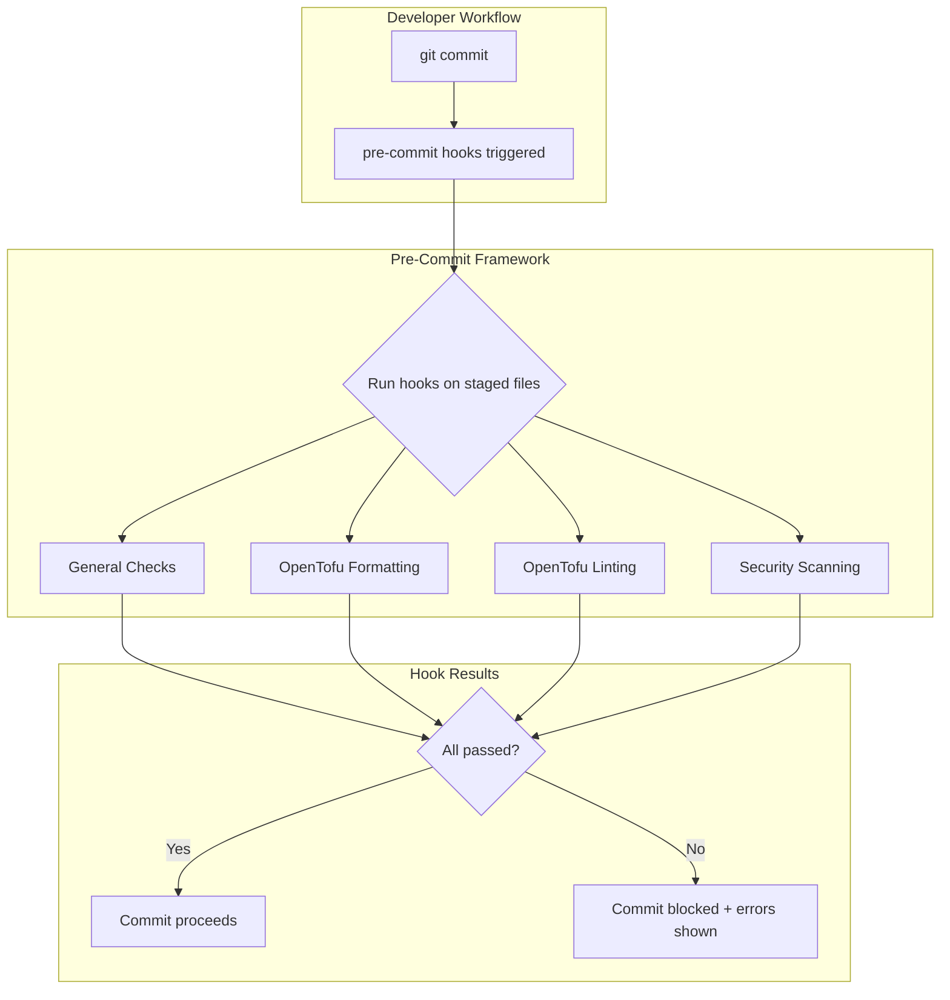

# Design Document: Pre-Commit Setup

## Overview

This design describes the implementation of pre-commit hooks for the LLM inference service project. The setup uses the pre-commit framework to orchestrate multiple code quality tools that run automatically before each git commit, ensuring consistent code style, catching errors early, and preventing security misconfigurations from reaching the repository.

## Architecture



## Components and Interfaces

### Pre-Commit Configuration File

The `.pre-commit-config.yaml` file in the repository root defines all hooks:

```yaml
repos:
  # General file checks
  - repo: https://github.com/pre-commit/pre-commit-hooks
    rev: v4.5.0
    hooks:
      - id: trailing-whitespace
      - id: end-of-file-fixer
      - id: check-yaml
      - id: check-merge-conflict
      - id: check-added-large-files
        args: ['--maxkb=1000']

  # OpenTofu/Terraform formatting
  - repo: https://github.com/antonbabenko/pre-commit-terraform
    rev: v1.88.0
    hooks:
      - id: terraform_fmt

  # OpenTofu/Terraform linting
  - repo: https://github.com/antonbabenko/pre-commit-terraform
    rev: v1.88.0
    hooks:
      - id: terraform_tflint
        args:
          - --args=--config=__GIT_WORKING_DIR__/.tflint.hcl

  # Security scanning
  - repo: https://github.com/antonbabenko/pre-commit-terraform
    rev: v1.88.0
    hooks:
      - id: terraform_tfsec
```

### TFLint Configuration

The `.tflint.hcl` file configures the OpenTofu linter:

```hcl
config {
  module = true
}

plugin "aws" {
  enabled = true
  version = "0.30.0"
  source  = "github.com/terraform-linters/tflint-ruleset-aws"
}

rule "terraform_naming_convention" {
  enabled = true
}

rule "terraform_deprecated_interpolation" {
  enabled = true
}

rule "terraform_unused_declarations" {
  enabled = true
}
```

### Tool Dependencies

| Tool | Purpose | Installation |
|------|---------|--------------|
| pre-commit | Hook framework | `pip install pre-commit` or `brew install pre-commit` |
| terraform | Formatting | Required for terraform_fmt hook |
| tflint | Linting | `brew install tflint` or download binary |
| tfsec | Security scanning | `brew install tfsec` or download binary |

## Data Models

### Hook Execution Result

Each hook produces a result with:
- Exit code (0 = pass, non-zero = fail)
- stdout/stderr output for error details
- List of files that were checked/modified

### Pre-Commit Configuration Schema

```yaml
repos:
  - repo: <repository_url>
    rev: <version_tag>
    hooks:
      - id: <hook_identifier>
        args: [<optional_arguments>]
        files: <optional_file_pattern>
        exclude: <optional_exclude_pattern>
```

## Correctness Properties

*A property is a characteristic or behavior that should hold true across all valid executions of a system—essentially, a formal statement about what the system should do. Properties serve as the bridge between human-readable specifications and machine-verifiable correctness guarantees.*

### Property 1: Hook Blocking on Failure

*For any* staged file set containing a formatting error, linting error, or security issue, the pre-commit framework SHALL block the commit and return a non-zero exit code.

**Validates: Requirements 1.4, 3.4, 4.5**

### Property 2: Formatting Idempotence

*For any* OpenTofu file, running terraform fmt twice in succession SHALL produce the same output as running it once (the operation is idempotent).

**Validates: Requirements 2.1, 2.2**

### Property 3: File Type Filtering

*For any* staged file, hooks SHALL only run on files matching their configured file patterns (.tf files for terraform hooks, .yaml for YAML linting).

**Validates: Requirements 2.3, 5.3**

## Error Handling

| Scenario | Behavior |
|----------|----------|
| Hook tool not installed | Pre-commit displays installation instructions and skips hook |
| Network unavailable during hook install | Pre-commit uses cached hooks if available, fails with clear error otherwise |
| Hook times out | Pre-commit terminates hook after configurable timeout (default 60s) |
| Partial staged files | Hooks run only on staged portions, not entire files |

## Testing Strategy

### Manual Verification

Since pre-commit hooks are development tooling, testing is primarily manual:

1. **Installation Test**: Run `pre-commit install` and verify `.git/hooks/pre-commit` is created
2. **Hook Execution Test**: Stage a file with trailing whitespace and verify commit is blocked
3. **Formatting Test**: Stage an unformatted .tf file and verify it gets auto-fixed
4. **Security Test**: Stage a .tf file with overly permissive security group and verify tfsec catches it

### CI Integration (Optional)

Pre-commit can run in CI as a safety net:

```yaml
# In GitHub Actions or similar
- name: Run pre-commit
  run: pre-commit run --all-files
```

This ensures hooks pass even if a developer bypasses local hooks with `--no-verify`.
